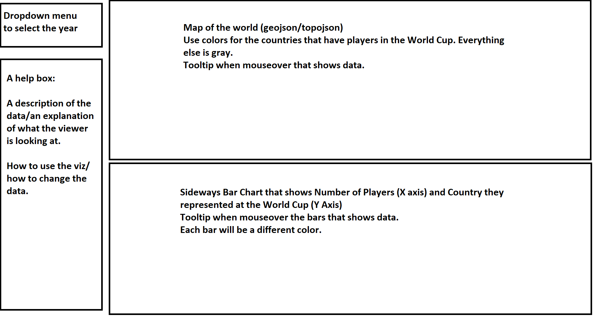

# Prospectus

I'm a big soccer fan so my plan is to create a map of the world that shows the countries that players that have played in various World Cups play their club soccer. Each soccer player has a "Club" team and a "National" team. Clubs are teams that represent their city, such as Futbol Club Barcelona, which plays in Barcelona, Spain. Some cities have multiple teams, such as Madrid, Spain, which has Real Madrid Club de Futbol and Club Atletico de Madrid. Soccer players are contracted to their club and play games against other clubs in whichever league their club plays in, such as La Liga, which is the top league in Spain. There are leagues in most countries around the world and they usually take place from August of one year to May of the next year. 

A National team, on the other hand, is a team that represents a country. FIFA, the main governing body for soccer, has their own competitions that pits national teams against each other. This includes the World Cup, which is the biggest national team competition in soccer. Soccer players represent their country, usually where they have citizenship, in these competitions. For example, Lionel Messi's club team is Futbol Club Barcelona in Spain and his national team is the Argentina National Football Team.

So my plan is to create something like this: https://public.tableau.com/profile/andy.kriebel#!/vizhome/WorldCupPlayers/WorldCup, but recreated using D3. The World Cup started in 1930 and only takes place once every four years so I should be able to compile data from every competition ever and implement a drop down menu for each year. There are lots of statistical sources for soccer like https://transfermarkt.com and https://whoscored.com. One goal of this project is to see how the number of players from each country has changed over the years. The other main goal of this project is to see how the representation of different countries in the World Cup has changed over the years. The target audience for this visualization would be fellow soccer fans. 

# Sketch

